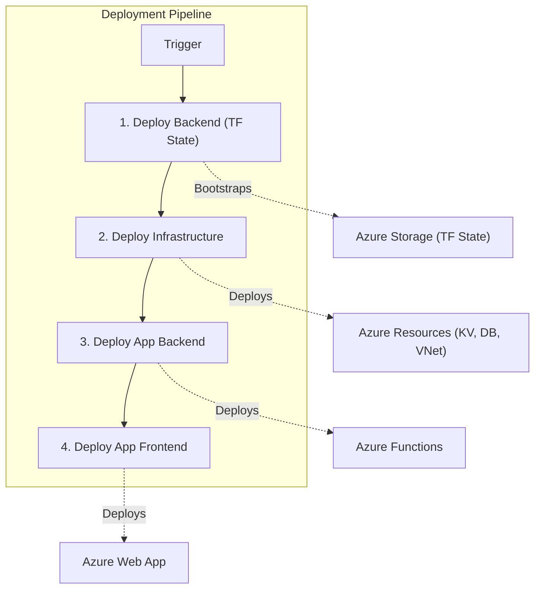

# 🏔️ AlpineBot.ch

> **Your AI-powered Sherpa for all things Switzerland.** 🇨🇭

Welcome to **AlpineBot**, the minimalist, precision-engineered (like a Swiss watch ⌚) platform that brings you up-to-date information about Switzerland. Whether you're looking for train schedules that are actually on time, the best fondue spots, or just need to know the capital of Jura, AlpineBot has you covered.

## 🚀 What is this?

AlpineBot is a RAG (Retrieval-Augmented Generation) system that combines the power of **Azure OpenAI (GPT-4o)** with specific, grounded Swiss data. It's not just another chatbot; it's a chatbot that knows the difference between Gruyère and Emmental. 🧀

## 🏗️ Architecture (The Technical Summit)

We've built this on a cloud-native PaaS architecture hosted right here in **Azure Switzerland North**. Because data privacy is as important to us as banking secrecy used to be. 😉 We use **VNet Integration** to ensure our data stays safe and sound.

### The Stack 🥞

- **Frontend**: React (Vite) - Fast as a bobsled. 🛷
- **Backend**: Python 3.11+ on Azure Functions - Reliable as a Swiss Army Knife. 🛠️
- **Database**: Azure Postgres with `pgvector` - Storing knowledge like gold bars. 🏦
- **AI**: Azure OpenAI (GPT-4o) - Smart as a theoretical physicist in Bern. 🧠
- **Infrastructure**: Terraform - Structured like a federal decree. 📜

## 🛠️ Getting Started

Want to run this locally? Lace up your hiking boots! 🥾

### Prerequisites

- Node.js & npm
- Python 3.11+
- Azure CLI
- Terraform

### Installation

1.  **Clone the repo** (Don't forget your crampons):

    ```bash
    git clone https://github.com/fpittelo/alpinebot2.git
    cd alpinebot2
    ```

2.  **Install Frontend Dependencies**:

    ```bash
    cd frontend
    npm install
    ```

3.  **Install Backend Dependencies**:

    ```bash
    cd backend
    python -m venv .venv
    source .venv/bin/activate  # or .venv\Scripts\activate on Windows
    pip install -r requirements.txt
    ```

4.  **Run it!**
    - Frontend: `npm run dev`
    - Backend: `func start`

## 🌲 Environments

We take our environments seriously. No yodeling in the library.

| Env      | Branch | Trigger       | Description                                     |
| :------- | :----- | :------------ | :---------------------------------------------- |
| **Dev**  | `dev`  | Push to `dev` | The playground. Expect turbulence. 🚧           |
| **QA**   | `qa`   | Manual        | The testing grounds. Strict quality control. 🧐 |
| **Prod** | `main` | Release Tag   | The summit. Pure, crisp, production air. 🏔️     |

### 🔄 DevOps Pipeline

> 🛑 **No Local Deployments:** Nothing is built or deployed locally. All infrastructure and code changes are executed exclusively via GitHub Actions.

The deployment pipeline consists of 4 distinct stages:

1.  **Deploy Backend (TF State)**: Bootstraps the Terraform backend (Storage Account & Resource Group).
2.  **Deploy Infrastructure**: Deploys core Azure resources (Key Vault, Postgres, Networking, etc.) using Terraform.
3.  **Deploy App Backend**: Deploys the Python Azure Functions.
4.  **Deploy App Frontend**: Deploys the Node.js Web App.



## 🤝 Contributing

Want to help us reach new heights? Check out [CONTRIBUTING.md](CONTRIBUTING.md). We welcome pull requests, bug reports, and chocolate donations. 🍫

## 📜 License

Private. Kept in a secure vault. 🔒

---

_Made with ❤️ and 🧀 in Switzerland._
